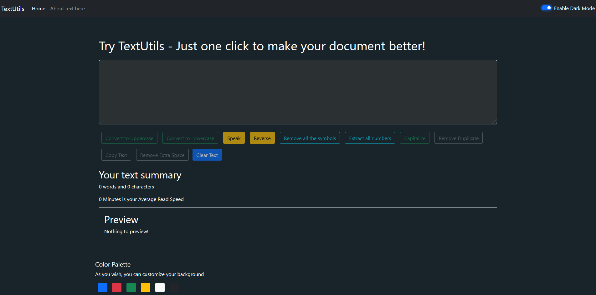

## TextUtils is a React-based application that provides seamless text editing with many useful features Features :
### 1. Dark theme features that make the app appear more appealing to the user
### 2. Convert to Uppercase
### 3. Convert to Lowercase
### 3. Speak
### 4. Reverse
### 5. Remove all the symbols
### 6. Extract all numbers
### 7. Capitalize
### 8. Remove Duplicate
### 9. Copy Text
### 10. Remove Extra Space
### 11. Words and Characters Count
### 12. Your Average Read Speed Count
### 13. Preview
### 14. Clear text
### 15. Color Palette

## How to run our React app?
1.Clone the repository

2.Run the following command:
In index.js, open the terminal and write

```
npm install
```
Wait for downloading the dependencies.Then run the app by typing
```
npm start
```

# How I made the app?

### Follow my own React Bootcamp course: [ 04 to 18 ]

https://github.com/Subham-Maity/react-js-bootcamp


#### [Other Link](https://textutils.subham-maity.repl.co/)
